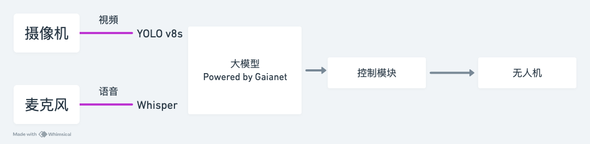

# EaglePilot项目介绍

## 一、想法来源

随着AI大模型的爆火，AI迅速席卷了各行各业，AI＋X变成了这个时代的主题。我们耳熟能详的AI＋X领域包括但不限于AI＋教育、AI＋智慧城市等。我们发现AI更多的赋能场景是在一些具体化的应用上，可以简单的理解AI＋行业。而其实有一个点容易被忽略，也是这些年出现的一个潮流，交叉学科。交叉学科指的是多学科的融合，所以AI和多学科进行联系。基于此角度，我们选择在AI+硬件领域开展项目，因为在这个领域属于交叉学科领域，硬件领域涉及机械、气动、嵌入式、控制、电子等多各学科，将这些学科与AI交叉融合会碰撞出十分强的火花。因此，我们选择了AI+无人机的路线，正好最近国家在低空经济有好的政策。对于项目的具体内容，我们选择无人机、AI在信号方向的交叉，因为无人机可以获取非常多的信号，同时AI本身也可以处理多种多样的信号，所以我们选择了这个方向。我们这个多种信号的处理方式也可以迁移到其他的硬件设备上，例如机器人、无人车、无人艇。

## 二、功能介绍

基于这个方向，我们设置了以下的功能：

我们首先希望通过语音命令来控制无人机的飞行，这样可以实现无人机与人的交互。另外，我们在无人机上使用视觉模型，将摄像头实时获取的信息进行处理，做到实时的视觉感知，实现一个目标检测功能。最后，我们将实时处理的视觉感知信息传给大语言模型，实现无人机的下一步指令。整个项目的核心功能就是无人机的声控飞行、半自动控制与视觉感知与根据用户的意愿来决策。另外，我们接入ROKID的AR眼镜，显示了无人机摄像头的目标检测画面，让无人机控制者更方便地、更身临其境地控制无人机的飞行。

## 三、技术介绍

使用YOLO v8s模型训练数据集，透过摄像头检测识别物体，使其成为无人机的眼睛，让操作者可以看见飞行器的视野，接着将视频透过Wi-Fi串流到后端，后端接入语音识别的模型，做自然语言处理，将视觉识别之位置信息和操作者发号的施令投送到大型语言模型，输出代码使其与飞控模块连结，远端操作无人机。

流程图路线：

## 四、遇到的困难&学习到的内容

一开始，我们发现硬件设备存在一些缺陷和缺少，所以我们临时定制了一套解决方案，这充分考量了我们的临场危机处理能力。在摄像头的烧录上，我们遇到了视频推流的困难，但在这个过程中我们积极克服困难，通过询问chatgpt和我们本身的个人知识，成功的完成了通过wifi进行了传输。语音控制，视觉模型的实时训练以及和无人机的通讯，和大模型的接口都是我们现场学习现场实践，并最终成功。这个过程很多的东西需要我们现时创造，现时尽快地思考解决方案，这是一件极限挑战的事情。我们这次克服的最大的困难应该是无人机的硬件不能满足时，我们通过各种方案与尝试最终在多次调试之后成功飞行。这就是嬉皮士精神，也是参与黑客松感受最深的东西，即虽然前路很难，但也会坚持地走下去，因为心中有信仰。

## 五、项目未来展望

下一步，我们将进一步完善我们的技术，对摄像头传输模块，我们会使用传输速度更加快速，延时减小，帧率（清晰度）更高的通信协议。对于视觉模型模块，我们会使用更好、更精确地模型进行训练，针对在无人机小目标物体检测上开展研究。对于语音交互与视觉感知和语言模型的融合，我们会考虑接入多模态模型让模型能处理的信息更加多元化。最后，我们希望将以上的各种处理从PC端迁移至无人机本体，实现无人机的智能体。

以上是一些技术层面的，关于未来的一些应用，我们可以考虑将其应用在智能家居与无人机助理上，智能家居指的是无人机可以携带麦克风/一些智能音响来控制家里的家具和家电，另外无人机可以记录一些发生的事情，对小孩/老人出现问题后可以预警，另外可以记录一些重要物品的地方。无人机助理的功能也类似。

在未来，可以实现无人机集群的类似功能感知，将无人机打造成AI agent,也可以考虑车机协同、边缘计算等领域。也可以往EVTOL（大型垂直升降无人机）发展。也可以考虑重新设计无人机的机型、机械结构等。
